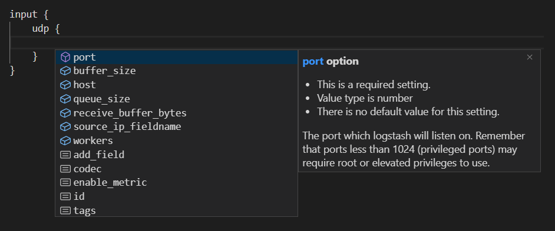
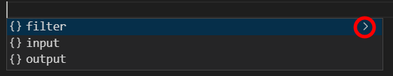

# VSCode Logstash Editor

Visual Studio Code extension that provides completion, documentation and auto-formatting for Logstash pipeline configuration files, logstash.yml, pipelines.yml, filebeat.yml and Elasticsearch index template json files.




## Features

- Provides completion for Logstash pipeline configuration files (sections, plugins, options), depending current cursor position.  
For example, if cursor is inside `grok` filter, options for `grok` filter are suggested.
- All completion data is generated based on official Logstash documentation
- Options for a plugin are sorted : first required options, then optional specific options, and finally optional common options
- When you preselect an item, a link to official documentation, a short description and an example (if available) are provided
- If you choose a completion item, a code snippet is automatically inserted with relevant content:
  - for a plugin, inserted snippet is the plugin block and all its required options
  - for an option, inserted snippet is based on option type (string, boolean, number, string_duration, array, hash) and option default value
- Provides completion for if statement
- Provides documentation when hover on a section, a plugin or an option
- Provides document formatting and document range formatting on a Logstash pipeline configuration file
- Provides completion for "logstash.yml" and "pipelines.yml" files
- Provides completion for Filebeat configuration files (version 8.19)
- Provides completion for Elasticsearch index template (and composable index template) json files
- Provides completion for Elasticsearch component template json files
- Provides a specific json schema for Elasticsearch index template 6.x, 7.x and 8.x
- Elasticsearch completion is based on [elasticsearch-specification](https://github.com/elastic/elasticsearch-specification/)
- Provides "logstash.version" configuration setting to choose Logstash version (for completion)
- Provides "Set Logstash Version" command (shortcut: Ctrl+Shift+L) to change Logstash version setting
- Supported Logstash versions: 6.8, 7.17, 8.14, 8.19 and latest
- Provides "logstash.enableDefaultVSCodeCompletion" setting to enable default VSCode completion when the extension does not have suggestions to provide
- Following file patterns are automatically associated to Logstash language:
  - `*logstash.conf`
  - `*logstash.conf.j2`
  - `*logstash.conf.template`
  - `logstash-*.conf`
- Following file patterns are automatically associated to Filebeat json schema:
  - `filebeat.yml`
  - `filebeat-*.yml`
  - `filebeat.config.inputs.yml`
  - `filebeat.config.modules.yml`
  - `filebeat*/inputs.d/*.yml`
  - `filebeat*/modules.d/*.yml`
- Following file patterns are automatically associated to Elasticsearch index template json schema:
  - `*elasticsearch-template-es8x*.json`
  - `*elasticsearch-template-es7x*.json`
  - `*elasticsearch-template-es6x*.json`
  - `*elasticsearch-template.json`
  - `*index-template*.json`
  - `*/_index_templates/*.json`
- Following file patterns are automatically associated to Elasticsearch component template json schema:
  - `*component-template*.json`
  - `*/_component_templates/*.json`


## Syntax highlighting

This extension does not provide syntax highlighting for Logstash configuration files, because this feature is already provdided by [Logstash Configuration Syntax / Language Support](https://marketplace.visualstudio.com/items?itemName=RandomChance.logstash) extension.  
Both extensions complement each other perfectly.


## Troubleshooting

- if completion does not work and your Visual Studio Code version is less than 1.52, upgrade your Visual Studio Code version.
- if you don't see documentation associated to completion suggestions, type "Ctrl + Space" once again or click on the ">" (or "i") button:



## Advanced tip: choose Elasticsearch index template minor version

By default, with Logstash Editor extension, Elasticsearch index template version is based on file name. And only major versions are supported (6, 7 and 8).

If you want to have completion for one specific minor version, you can do it in 2 ways:
- you use "$schema" attribute in index template JSON file:
``` json
{
  "$schema": "https://raw.githubusercontent.com/fbaligand/vscode-logstash-editor/es-<MINOR_VERSION>/jsonschemas/elasticsearch-template-es<MAJOR_VERSION>x.schema.json"
}
```
- in Visual Studio Code settings, you associate you index template file pattern with URL to JSON schema:
``` json
"json.schemas": [
    {
        "fileMatch": [
            "/my-elasticsearch-index-template.json"
        ],
        "url": "https://raw.githubusercontent.com/fbaligand/vscode-logstash-editor/es-<MINOR_VERSION>/jsonschemas/elasticsearch-template-es<MAJOR_VERSION>x.schema.json"
    }
]
```

In both cases, you replace `<MINOR_VERSION>` with one of the supported minor versions: `6.8`, `7.2`, `7.5`, `7.9`, `7.12`, `7.17`, `8.14` or `8.19`.  
In both cases, you replace `<MAJOR_VERSION>` with one of the supported major versions: `6`, `7` or `8`.  
Example URL: https://raw.githubusercontent.com/fbaligand/vscode-logstash-editor/es-8.19/jsonschemas/elasticsearch-template-es8x.schema.json


## Advanced tip: choose Filebeat schema minor version

By default, with Logstash Editor extension, Filebeat schema version is the latest supported by the extension (`8.19`).

If you want to have completion for one specific minor version, you can do it in 2 ways:
- you use `yaml-language-server` comment instruction in Filebeat configuration YAML file:
``` yaml
# yaml-language-server: $schema=https://raw.githubusercontent.com/fbaligand/vscode-logstash-editor/refs/tags/filebeat-<MINOR_VERSION>/yamlschemas/filebeat.yml.schema.json
```  
or  
``` yaml
# yaml-language-server: $schema=https://raw.githubusercontent.com/fbaligand/vscode-logstash-editor/refs/tags/filebeat-<MINOR_VERSION>/yamlschemas/filebeat.config.inputs.yml.schema.json
```  
or  
``` yaml
# yaml-language-server: $schema=https://raw.githubusercontent.com/fbaligand/vscode-logstash-editor/refs/tags/filebeat-<MINOR_VERSION>/yamlschemas/filebeat.config.modules.yml.schema.json
```  
- in Visual Studio Code settings, you associate your Filebeat configuration file pattern with URL to JSON schema:
``` json
"yaml.schemas": {
    "https://raw.githubusercontent.com/fbaligand/vscode-logstash-editor/refs/tags/filebeat-<MINOR_VERSION>/yamlschemas/filebeat.yml.schema.json": "my-filebeat.yml",
    "https://raw.githubusercontent.com/fbaligand/vscode-logstash-editor/refs/tags/filebeat-<MINOR_VERSION>/yamlschemas/filebeat.config.inputs.yml.schema.json": "my-filebeat-inputs.yml",
    "https://raw.githubusercontent.com/fbaligand/vscode-logstash-editor/refs/tags/filebeat-<MINOR_VERSION>/yamlschemas/filebeat.config.modules.yml.schema.json": "my-filebeat-modules.yml"
}
```

In both cases, you replace `<MINOR_VERSION>` with one of the supported minor versions: `7.12`, `7.17`, `8.14` or `8.19`.  
Example URL: https://raw.githubusercontent.com/fbaligand/vscode-logstash-editor/refs/tags/filebeat-8.19/yamlschemas/filebeat.yml.schema.json


## Limitations

For now, only this format style is supported for completion in Logstash configuration files:
``` ruby
filter {
	tcp {
		port => 12345
	}
}
```

This format style is not supported:
``` ruby
filter 
{
	tcp 
	{
		port => 12345
	}
}
```

Neither this one:
``` ruby
filter { tcp { port => 12345 } }
```
